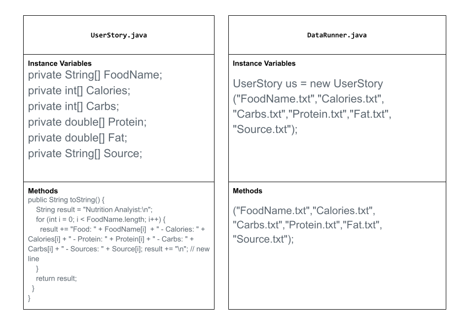

# asphalt-art-project-
# Unit 2 - Data for Social Good Project

## Introduction

Software engineers develop programs to work with data and provide information to a user. Each user has different needs based on the information they are looking for from data. Your goal is to create a data analysis program for your user that stores and analyzes data to provide the information they need.

## Requirements

Use your knowledge of object-oriented programming, one-dimensional (1D) arrays, and algorithms to create your data analysis program:
- **Write a class** – Write a class to represent your user or business and store and analyze their data with no-argument and parameterized constructors.
- **Create at least two 1D arrays** – Create at least two 1D arrays to store the data that your user needs information about.
- **Write a method** – Write a method that finds or manipulates the elements in a 1D array to provide the information your user needs.
- **Implement a toString() method** – Write a toString() method that returns general information about the data (for example, number of values in the dataset).
- **Document your code** – Use comments to explain the purpose of the methods and code segments and note any preconditions and postconditions.

## User Story  

> As a health-conscious user, 
> I want to see what the healthiest is 
depending on if I wanted to lose or gain weight.  
> so that I can better dietary choices.

## Dataset 

Include a hyperlink to the source of your dataset used for this project. Additionally, provide a short description of each column used from the dataset, and the data type. 

https://fdc.nal.usda.gov/

https://www.healthline.co  

https://whatyoueat.io/foods/

FoodName: String 
Carb: (int) - the amount of Carbs in the food item.
Calories: (int) - the amount of Calories in the food item.
Protein: (double) - the amount of Protein in the food item.
Fat: (double) - the amount of Fat in the food item.
source: (String) - source of each food in the dataset.

## UML Diagram 

Put an image of your UML Diagram here. Upload the image of your UML Diagram to your repository, then use the Markdown syntax to insert your image here. Make sure your image file name is one work, otherwise it might not properly get displayed on this README. 

 

## Description 

For my unit 3 APCSA project I designed a Java program that lets a user quickly access nutritonal information from a dataset of foods to make healthier decisions and eating habits. How I did this includes making a data set with multiple arrays like an array for FoodName, Calories, Carbs, etc. these arrays are stored as instance variables in the UserStory class. the program uses methods to read the text files of information from the dataset and with these methods I am able to print in the console my dataset of foods and there nutritional breakdown. 

